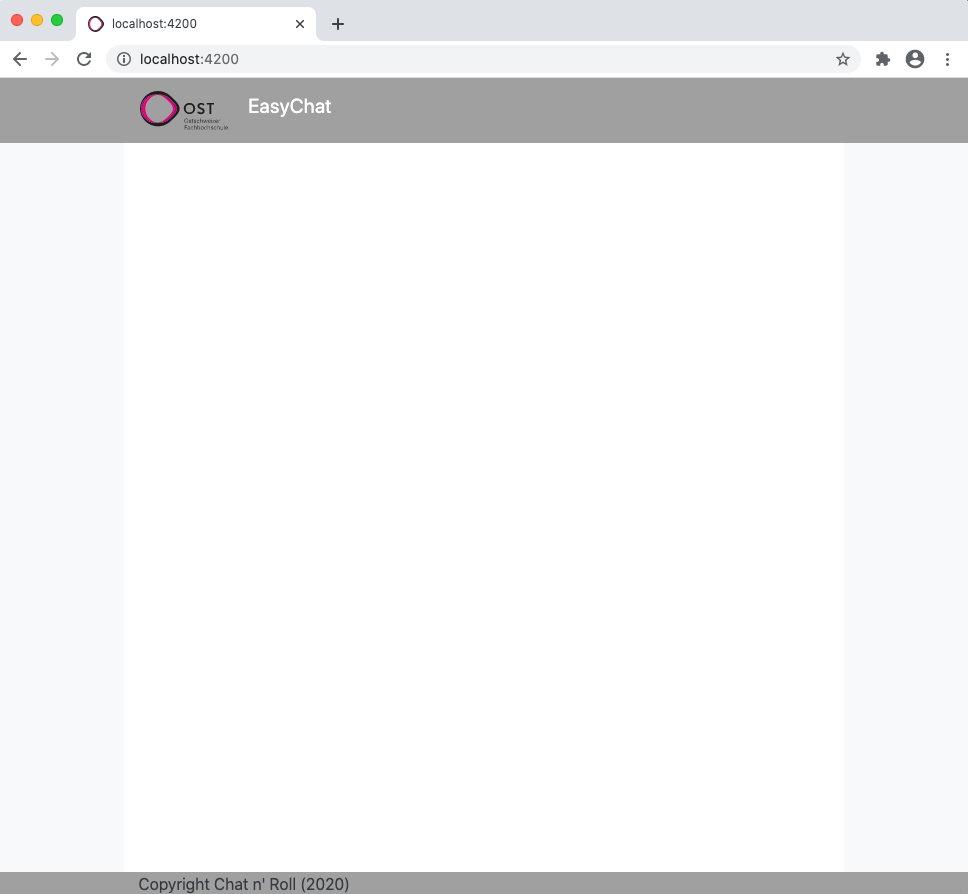

# Retrospective Sprint 1

## Tiefpunkte
- Planung war schwierig, da die Stories so klein waren, dass sich das Splitten in Unteraufgaben kaum gelohnt hat.

## Hochpunkte
- Alle Punkte konnten wunschgemäss umgesetzt werden
- Das Testing war überschaubar
- Gute Einarbeitung im Team mit Framework (teilweise bereits bekannt)

## Was verbessern wir?
- Mehr Storys und Tasks einplanen
- bessere Verantwortlichkeiten definieren (wer setzt was um?) und sich auch daran halten
- Pull Requests erst freigeben, wenn das Testing in der Story oder im Subtask durchgeführt wurde (Board beachten!)

## Ergebnis des 1. Inkrements
- Alle Storys und Tasks, die in diesem Sprint eingeplant wurden, sind umgesetzt
- Es tauchten bei der Umsetzug keine Probleme auf

