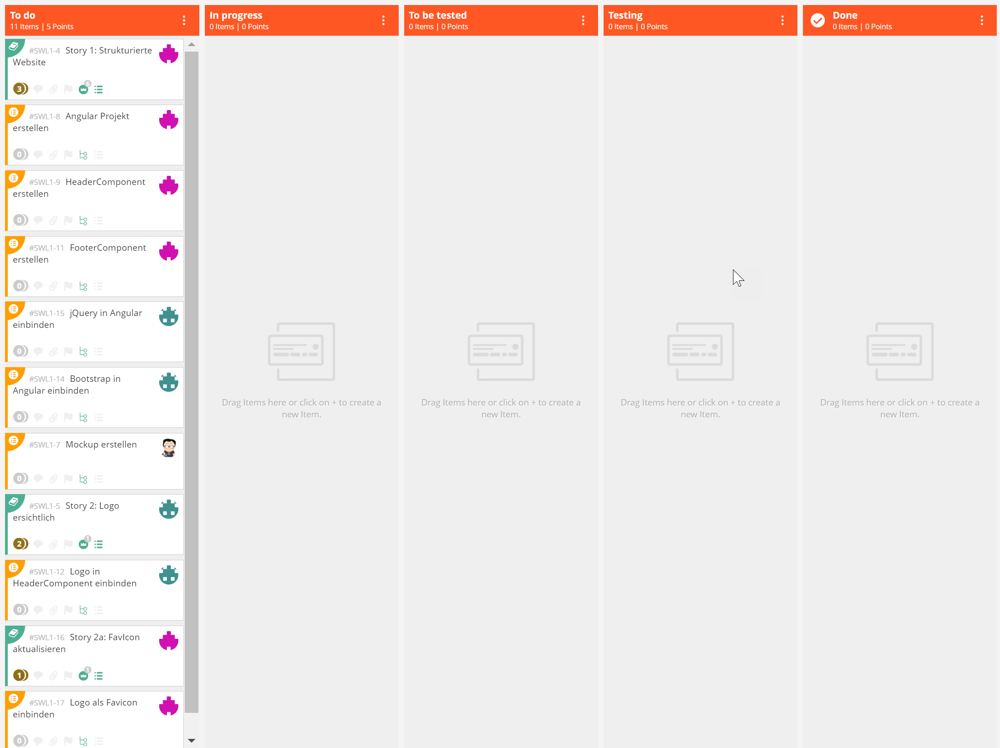
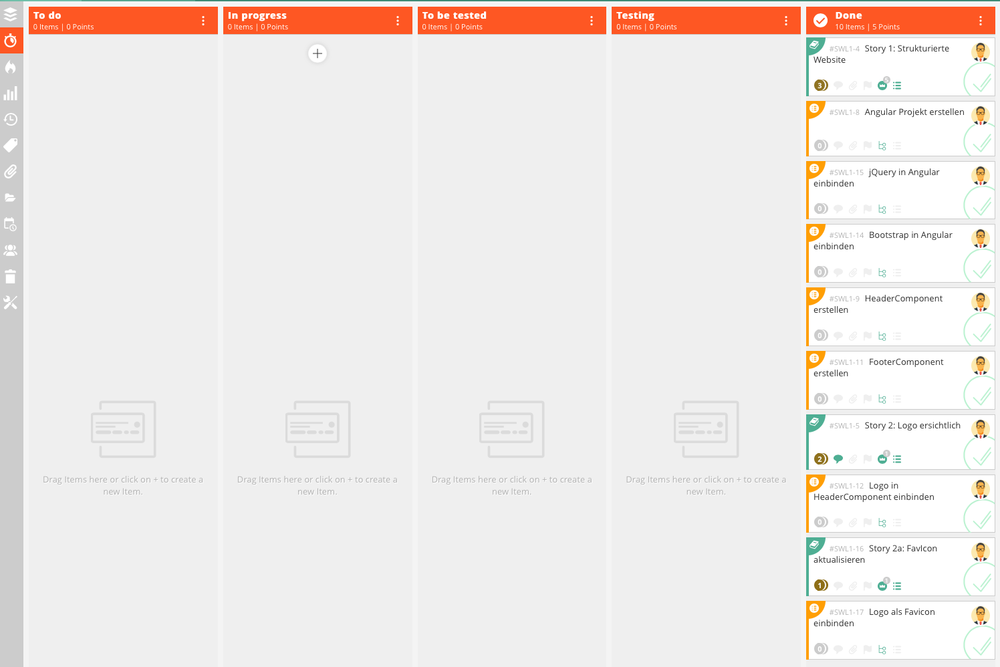

# Sprint Review - Sprint 1 - 05.10.20 - 18.10.20

## Stories
|Name|Beschreibung|Status|
|-|-|-|
|Story 1: Strukturierte Website|Als Chatbenutzer möchte ich eine strukturierte Webseite, damit ich eine schnelle Übersicht der Applikation habe.||
|Story 2: Logo ersichtlich|Als Chatbetreiber möchte ich ein Logo auf der Seite haben, damit die Seite einen hohen Wiedererkennungswert hat.||
|Story 2a: FavIcon aktualisieren|Als Kunde möchte ich im Tab-Reiter der Webseite das FavIcon verwenden, um die Identifikation der Webseite zu verbessern.||

## Screenshot Board

### Beginn des Sprints

### Ende des Sprints

## Ergebnis des 1. Inkrements
- Alle Storys und Tasks, die in diesem Sprint eingeplant wurden, sind umgesetzt
- Getestet wurde die Ansicht im Google Chrome

## Probleme bei der Umsetzung
- keine -> Es waren einfache Storys für die Umsetzung

## Inputs Teilnehmer
- PO: zu wenig "Arbeit", um einen kompletten Sprint durchzuziehen
- Entwicklung: Umsetzung war sehr einfach
- QS: Testplan war nicht notwendig, da keine "Funktionalitäten" getestet werden mussten (nur Anzeige im Browser)
- UI: keine Inputs
- Kunde: 